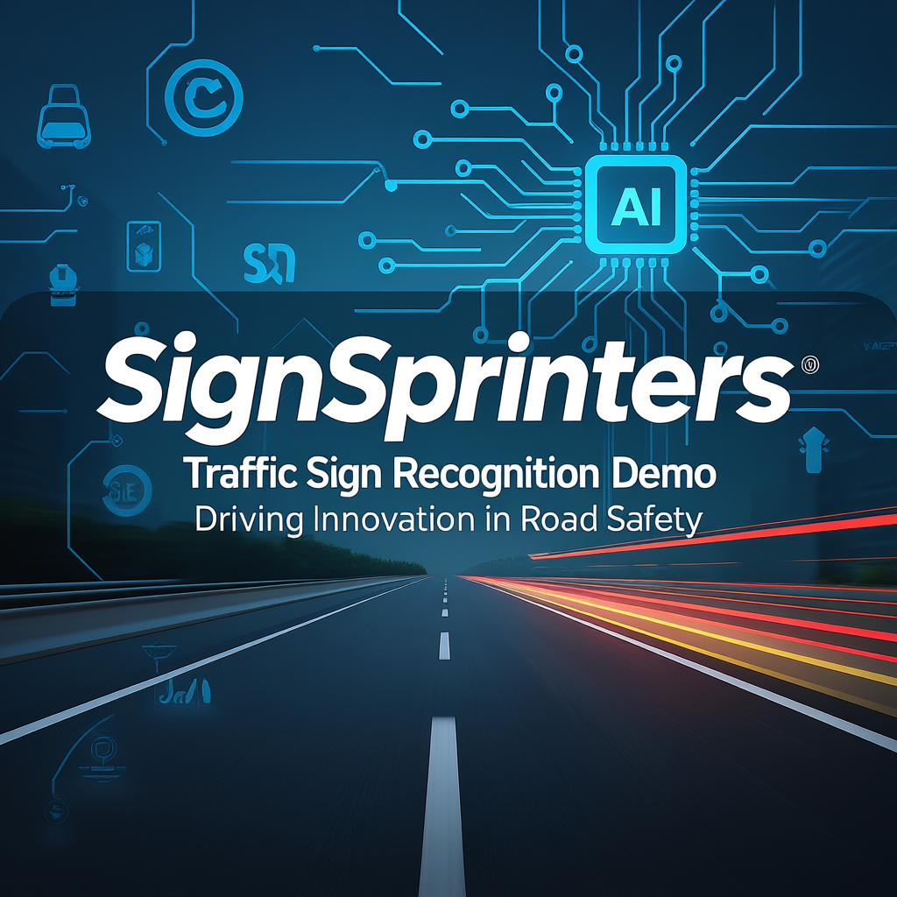

# SignSprinters – Traffic Sign Recognition Demo (TSRS)

 
 
 

---

## 1. Introduction
**SignSprinters** is an organization formed to demonstrate how **Software Engineering principles** can be applied to impactful, real-world challenges.  

Our flagship project, the **Traffic Sign Recognition Demo (TSRS)**, combines **artificial intelligence**, **gamification**, and **Agile methodology** to deliver an interactive system that educates users on traffic signs while showcasing the value of structured software engineering practices.  

In our Agile team, the **Scrum Master also contributed as a developer**, balancing sprint facilitation with active coding and implementation tasks.  
Akshat focused on the **machine learning pipeline and testing**, ensuring accuracy and reliability across iterations.

---

## 2. Purpose
The purpose of this project is to:
- Reinforce **traffic sign awareness** in an engaging, interactive format.  
- Provide a **gamified training tool** for driving schools and learners.  
- Demonstrate the application of **Agile practices** in a collaborative environment.  
- Serve as a foundation for **AI-driven transport systems** and future research in autonomous driving.  

---

## 3. Scope
- **Users**: Play a racing game where traffic signs appear randomly on the track. Correct recognition ensures smooth progress, while mistakes trigger consequences such as speed reduction or penalties.  
- **System**: Integrates a stubbed machine learning model for recognition, displays confidence scores, and applies game mechanics in real time.  
- **Administrators**: Monitor player performance, review logs, and retrain the ML model with updated datasets.  

Practical applications include:
- Driver education in schools  
- Gamified road safety awareness programs  
- Research prototypes for AI in transportation systems  

---

## 4. Methodology
The project was developed using the **Agile Scrum framework**:
- **Sprint Planning**: Defined goals for each development cycle.  
- **Daily Standups**: Identified blockers and tracked progress.  
- **Sprint Reviews**: Presented working increments to mentors.  
- **Retrospectives**: Reflected on improvements for the next cycle.  

The Scrum Master acted as a **developer**, contributing directly to system implementation.  
Akshat was responsible for **machine learning model integration and testing**, ensuring the reliability of predictions and gameplay responses.  

Security was addressed using the **Secure Software Development Life Cycle (SecSDLC)**, with input validation, HTTPS enforcement, and safe data handling.

---

## 5. Team Contributions
| Role                         | Member          | Contribution Area                              |
|------------------------------|-----------------|------------------------------------------------|
| Scrum Master & Developer     | Adishree Gupta  | Sprint facilitation, Agile documentation, development contributions , Machine Learning|
| Developer                    | Akshat          | Gameplay Features , Testing                      |
| Developer                    | Monica M        | UI/UX Design, Gameplay Features                |
| Developer                    | Aditya Sharma   | Dataset Curation, Preprocessing                |

---

## 6. Technology Stack
- **Frontend**: Web-based dashboard and gameplay interface  
- **Backend**: Python (Flask / FastAPI)  
- **Machine Learning**: TensorFlow / PyTorch (stubbed model, future-ready)  
- **Database**: MySQL for storing logs and reports  
- **Version Control & Workflow**: GitHub with Agile-driven development  

---

## 7. Vision
The **Traffic Sign Recognition Demo** demonstrates how **structured software engineering, Agile teamwork, and AI innovation** can address real-world issues like road safety.  

Our vision is to extend the project by:
- Integrating a production-ready ML model.  
- Expanding to global traffic sign datasets.  
- Enhancing gamification with multiplayer and adaptive difficulty.  
- Exploring applications in **autonomous driving research and smart city systems**.  

---
## 🔗 View the Project
Click here to explore the full project repository:  
👉 [Traffic Sign Recognition Demo](https://github.com/SignSprinters/Traffic-Sign-Recognition-Demo)

---

## 8. Conclusion
**SignSprinters** represents how a motivated team of students can apply **engineering discipline, innovation, and Agile values** to create meaningful solutions.  

This project is more than an academic exercise—it is a showcase of how software engineering can combine with AI to **educate, engage, and inspire real-world impact**.  

**SignSprinters – Driving the future of road safety through technology and teamwork.**
